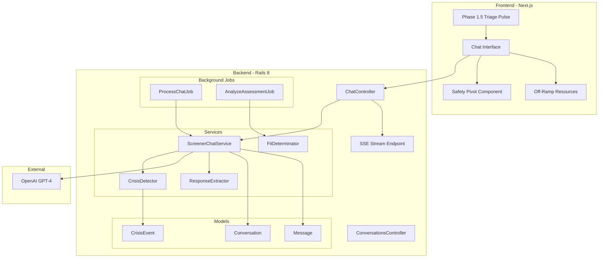

# Phase 2: AI Integration Implementation Plan

## Summary

Replace the static PSC-17 screener with an AI-powered conversational chatbot that administers clinical screeners empathetically. Add Phase 1.5 (Triage Pulse) for routing, implement crisis detection with safety pivots, and enable real-time streaming responses.---

## Architecture Overview



---

## Implementation Steps

### 1. Database Models for Conversations

Create the data layer for storing chat history and crisis events.**Files to create:**

- [`backend/db/migrate/XXXXXX_create_conversations.rb`](backend/db/migrate/XXXXXX_create_conversations.rb)
- [`backend/db/migrate/XXXXXX_create_messages.rb`](backend/db/migrate/XXXXXX_create_messages.rb)
- [`backend/db/migrate/XXXXXX_create_crisis_events.rb`](backend/db/migrate/XXXXXX_create_crisis_events.rb)
- [`backend/app/models/conversation.rb`](backend/app/models/conversation.rb)
- [`backend/app/models/message.rb`](backend/app/models/message.rb)
- [`backend/app/models/crisis_event.rb`](backend/app/models/crisis_event.rb)

**Schema additions:**

- `conversations`: Links to assessment, stores screener_type, status, metadata
- `messages`: sender (ai/user), content, extracted_response JSONB, crisis_flags
- `crisis_events`: risk_level, trigger_content, context, resolved_at

---

### 2. Phase 1.5: Triage Pulse UI

Create the routing layer that directs users to appropriate screeners based on concern areas.**Files to create:**

- [`frontend/src/app/(onboarding)/phase-1-5/page.tsx`](frontend/src/app/\\\\(onboarding)/phase-1-5/page.tsx)
- [`frontend/src/components/onboarding/concern-selector.tsx`](frontend/src/components/onboarding/concern-selector.tsx)
- [`frontend/src/components/onboarding/pulse-questions.tsx`](frontend/src/components/onboarding/pulse-questions.tsx)
- [`frontend/src/lib/utils/screener-router.ts`](frontend/src/lib/utils/screener-router.ts)
- [`frontend/src/lib/constants/screeners/phq9a.ts`](frontend/src/lib/constants/screeners/phq9a.ts)
- [`frontend/src/lib/constants/screeners/scared.ts`](frontend/src/lib/constants/screeners/scared.ts)

**Routing logic:**| Selection | Screener ||-----------|----------|| Mood | PHQ-9A || Anxiety | SCARED || Behavior | PSC-17 || Not sure | PSC-17 (broadband) |---

### 3. Chat Interface UI Components

Build the conversational interface for the AI-administered screener.**Files to create:**

- [`frontend/src/components/chat/chat-container.tsx`](frontend/src/components/chat/chat-container.tsx)
- [`frontend/src/components/chat/chat-message.tsx`](frontend/src/components/chat/chat-message.tsx)
- [`frontend/src/components/chat/chat-input.tsx`](frontend/src/components/chat/chat-input.tsx)
- [`frontend/src/components/chat/typing-indicator.tsx`](frontend/src/components/chat/typing-indicator.tsx)
- [`frontend/src/components/chat/quick-replies.tsx`](frontend/src/components/chat/quick-replies.tsx)
- [`frontend/src/hooks/use-chat.ts`](frontend/src/hooks/use-chat.ts)

**Key patterns:**

- Use existing theme tokens from [`_docs/theme-rules.md`](_docs/theme-rules.md) for chat styling
- AI messages: left-aligned with `primary-50` background
- User messages: right-aligned with `neutral-100` background
- ARIA live regions for screen reader accessibility

---

### 4. LLM Service Integration

Integrate OpenAI GPT-4 with LangChain for conversation orchestration.**Files to create:**

- [`backend/config/initializers/openai.rb`](backend/config/initializers/openai.rb)
- [`backend/app/services/ai/screener_chat_service.rb`](backend/app/services/ai/screener_chat_service.rb)
- [`backend/app/services/ai/prompt_builder.rb`](backend/app/services/ai/prompt_builder.rb)
- [`backend/app/services/ai/conversation_memory.rb`](backend/app/services/ai/conversation_memory.rb)
- [`backend/lib/prompts/screener_system.txt`](backend/lib/prompts/screener_system.txt)
- [`backend/lib/prompts/phq9a_context.txt`](backend/lib/prompts/phq9a_context.txt)
- [`backend/lib/prompts/psc17_context.txt`](backend/lib/prompts/psc17_context.txt)

**Key implementation using langchainrb:**

```ruby
# Using Langchain::Assistant with streaming
llm = Langchain::LLM::OpenAI.new(
  api_key: Rails.application.credentials.openai_api_key,
  default_options: { temperature: 0.4, chat_model: "gpt-4o" }
)

assistant = Langchain::Assistant.new(
  llm: llm,
  instructions: system_prompt
) do |chunk|
  # Stream chunks via SSE
end
```

---

### 5. Crisis Detection Service

Implement real-time monitoring for high-risk signals during conversation.**Files to create:**

- [`backend/app/services/ai/crisis_detector.rb`](backend/app/services/ai/crisis_detector.rb)
- [`backend/app/services/ai/sentiment_analyzer.rb`](backend/app/services/ai/sentiment_analyzer.rb)

**Risk levels:**| Level | Triggers | Action ||-------|----------|--------|| CRITICAL | suicide, self-harm explicit | Immediate safety pivot || HIGH | abuse, self-harm ideation | Safety resources shown || MEDIUM | hopeless, worthless | Monitor, empathetic response || LOW | sad, anxious | Continue with empathy |Crisis events logged to `crisis_events` table for clinical review.---

### 6. Safety Pivot Flow

Create the emergency response flow when crisis is detected.**Files to create:**

- [`frontend/src/components/onboarding/safety-pivot.tsx`](frontend/src/components/onboarding/safety-pivot.tsx)
- [`frontend/src/components/onboarding/crisis-resources.tsx`](frontend/src/components/onboarding/crisis-resources.tsx)
- [`frontend/src/lib/constants/safety-resources.ts`](frontend/src/lib/constants/safety-resources.ts)
- [`backend/app/services/safety/pivot_service.rb`](backend/app/services/safety/pivot_service.rb)

**Safety resources displayed:**

- 988 Suicide & Crisis Lifeline
- Crisis Text Line (text HOME to 741741)
- Emergency: 911
- "I'm safe" continue option

---

### 7. Streaming Responses via SSE

Implement Server-Sent Events for real-time AI response streaming.**Files to create:**

- [`backend/app/controllers/api/v1/chat_controller.rb`](backend/app/controllers/api/v1/chat_controller.rb)
- [`backend/lib/sse_renderer.rb`](backend/lib/sse_renderer.rb)
- [`frontend/src/hooks/use-chat-stream.ts`](frontend/src/hooks/use-chat-stream.ts)
- [`frontend/src/lib/api/stream-client.ts`](frontend/src/lib/api/stream-client.ts)

**API endpoints:**

```javascript
POST /api/v1/chat/messages     # Send user message
GET  /api/v1/chat/stream       # SSE stream for AI response
GET  /api/v1/conversations/:id # Get conversation history
```

**SSE implementation using ruby-openai streaming:**

```ruby
client.chat(
  parameters: {
    model: "gpt-4o",
    messages: messages,
    stream: proc do |chunk, _event|
      # Write to SSE connection
      sse.write(chunk.dig("choices", 0, "delta", "content"))
    end
  }
)
```

---

### 8. Screener Question Extraction

Enable AI to extract structured responses from conversational answers.**Files to create:**

- [`backend/app/services/ai/response_extractor.rb`](backend/app/services/ai/response_extractor.rb)
- [`backend/app/models/screener_response.rb`](backend/app/models/screener_response.rb)
- [`backend/db/migrate/XXXXXX_create_screener_responses.rb`](backend/db/migrate/XXXXXX_create_screener_responses.rb)

Uses OpenAI function calling to extract:

```json
{
  "question_id": "phq9a_q1",
  "response_text": "I feel that way almost every day",
  "extracted_value": 3,
  "confidence": 0.95
}
```

---

### 9. Assessment Completion & Fit Determination

Process completed assessments and route users appropriately.**Files to create:**

- [`backend/app/services/assessments/analyze_service.rb`](backend/app/services/assessments/analyze_service.rb)
- [`backend/app/services/assessments/fit_determinator.rb`](backend/app/services/assessments/fit_determinator.rb)
- [`frontend/src/app/(onboarding)/off-ramp/page.tsx`](frontend/src/app/\\\\(onboarding)/off-ramp/page.tsx)
- [`frontend/src/components/onboarding/resource-referral.tsx`](frontend/src/components/onboarding/resource-referral.tsx)

**Fit criteria:**

- Good fit: Mild to moderate symptoms, no imminent risk → Phase 3
- Not a fit: Severe symptoms, crisis, specialized needs → Off-ramp with resources

---

### 10. Background Job Processing

Move LLM calls to background jobs for reliability.**Files to create:**

- [`backend/app/jobs/process_chat_job.rb`](backend/app/jobs/process_chat_job.rb)
- [`backend/app/jobs/analyze_assessment_job.rb`](backend/app/jobs/analyze_assessment_job.rb)

Update [`backend/config/initializers/good_job.rb`](backend/config/initializers/good_job.rb) with queue configuration:

```ruby
config.good_job.queues = 'critical:5;chat:3;default:2;low:1'
```

---

### 11. Update Phase 2 Page

Replace static screener with chat interface.**Files to modify:**

- [`frontend/src/app/(onboarding)/phase-2/page.tsx`](frontend/src/app/\\\\(onboarding)/phase-2/page.tsx)

**Files to update:**

- [`frontend/src/stores/onboarding-store.tsx`](frontend/src/stores/onboarding-store.tsx) - add conversationId, screenerType
- [`backend/config/routes.rb`](backend/config/routes.rb) - add chat and conversation routes

---

## File Summary

| Category | New Files | Modified Files ||----------|-----------|----------------|| Database | 4 migrations | schema.rb || Models | 4 (Conversation, Message, CrisisEvent, ScreenerResponse) | Assessment || Services | 8 | - || Controllers | 2 | routes.rb || Jobs | 2 | good_job.rb || Frontend Components | 10 | phase-2/page.tsx || Hooks | 2 | - || Constants/Prompts | 6 | phases.ts |---

## Definition of Done

- AI chatbot administers screener conversationally
- Phase 1.5 routes to appropriate screener type
- Crisis detection identifies high-risk signals and logs events
- Safety pivot displays resources for critical risk
- Responses stream in real-time via SSE