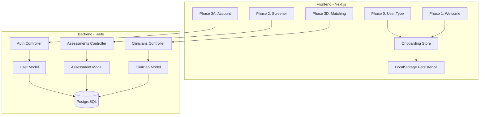

# Phase 1 MVP Implementation Plan

## Current State

The project has a solid foundation from Phase 0 setup:

- **Backend**: Rails 8 API with Gemfile configured (Devise, JWT, Pundit), empty schema with UUID extension, base controller structure
- **Frontend**: Next.js 16 with Tailwind v4, theme configured per `theme-rules.md`, API client ready, shadcn/ui components (Button, Card, Input)
- **Infrastructure**: Docker Compose ready, Makefile with dev commands

## Architecture Overview



---

## Implementation Order

### 1. Database Models and Migrations

Create foundational data models with UUID primary keys per HIPAA best practices.**Backend Files:**

- [`backend/db/migrate/XXXXXX_enable_uuid_extension.rb`](backend/db/migrate/) - Enable pgcrypto (already done)
- [`backend/db/migrate/XXXXXX_create_users.rb`](backend/db/migrate/) - User with Devise fields + user_type, phone, profile JSONB
- [`backend/db/migrate/XXXXXX_create_assessments.rb`](backend/db/migrate/) - Assessment with status, screener_type, responses/results JSONB
- [`backend/db/migrate/XXXXXX_create_clinicians.rb`](backend/db/migrate/) - Clinician with credentials, specialties, bio, photo_url
- [`backend/db/migrate/XXXXXX_create_appointments.rb`](backend/db/migrate/) - Appointment linking user/clinician
- [`backend/db/migrate/XXXXXX_create_jwt_denylist.rb`](backend/db/migrate/) - JWT token revocation

**Models:**

- [`backend/app/models/user.rb`](backend/app/models/) - Devise modules, validations, associations
- [`backend/app/models/assessment.rb`](backend/app/models/) - Status enum, JSONB accessors
- [`backend/app/models/clinician.rb`](backend/app/models/) - Specialties array, availability
- [`backend/app/models/appointment.rb`](backend/app/models/) - Status enum, scheduled_at
- [`backend/app/models/jwt_denylist.rb`](backend/app/models/) - Devise JWT revocation strategy

**Factories:**

- [`backend/spec/factories/users.rb`](backend/spec/factories/)
- [`backend/spec/factories/assessments.rb`](backend/spec/factories/)
- [`backend/spec/factories/clinicians.rb`](backend/spec/factories/)
- [`backend/spec/factories/appointments.rb`](backend/spec/factories/)

---

### 2. Authentication System (Devise + JWT)

Configure Devise with JWT for stateless API authentication.**Backend Files:**

- [`backend/config/initializers/devise.rb`](backend/config/initializers/) - Configure JWT, session timeout, password policy
- [`backend/config/routes.rb`](backend/config/routes.rb) - Add Devise routes under `/api/v1/auth`
- [`backend/app/controllers/api/v1/auth/registrations_controller.rb`](backend/app/controllers/api/v1/) - Custom registration
- [`backend/app/controllers/api/v1/auth/sessions_controller.rb`](backend/app/controllers/api/v1/) - Login/logout with JWT
- Update [`backend/app/controllers/api/v1/base_controller.rb`](backend/app/controllers/api/v1/base_controller.rb) - Add `authenticate_user!` and `current_user`

**Frontend Files:**

- [`frontend/src/lib/api/auth.ts`](frontend/src/lib/api/) - Auth API functions (register, login, logout)
- [`frontend/src/hooks/use-auth.ts`](frontend/src/hooks/) - Auth state management hook
- [`frontend/src/types/user.ts`](frontend/src/types/) - User type definitions

---

### 3. Onboarding State Management and Layout

Create the shared onboarding infrastructure.**Frontend Files:**

- [`frontend/src/app/(onboarding)/layout.tsx`](frontend/src/app/) - Onboarding layout with progress indicator
- [`frontend/src/stores/onboarding-store.ts`](frontend/src/stores/) - Zustand or Context store for onboarding state
- [`frontend/src/hooks/use-onboarding-state.ts`](frontend/src/hooks/) - Hook wrapping the store
- [`frontend/src/hooks/use-form-persistence.ts`](frontend/src/hooks/) - LocalStorage persistence hook
- [`frontend/src/lib/utils/storage.ts`](frontend/src/lib/utils/) - Storage helpers with expiration
- [`frontend/src/lib/constants/phases.ts`](frontend/src/lib/constants/) - Phase definitions and routes

**Components:**

- [`frontend/src/components/onboarding/progress-indicator.tsx`](frontend/src/components/onboarding/) - Shows all phases with states
- [`frontend/src/components/onboarding/progress-step.tsx`](frontend/src/components/onboarding/) - Individual step component
- [`frontend/src/components/onboarding/save-progress-button.tsx`](frontend/src/components/onboarding/) - Save and continue later
- [`frontend/src/components/onboarding/resume-prompt.tsx`](frontend/src/components/onboarding/) - Resume saved session dialog

---

### 4. Phase 0: Identification Lobby

User type selection as entry point to onboarding.**Frontend Files:**

- [`frontend/src/app/(onboarding)/phase-0/page.tsx`](frontend/src/app/) - Main page with selection cards
- [`frontend/src/app/(onboarding)/phase-0/loading.tsx`](frontend/src/app/) - Loading skeleton
- [`frontend/src/components/onboarding/user-type-selector.tsx`](frontend/src/components/onboarding/) - Container component
- [`frontend/src/components/onboarding/user-type-card.tsx`](frontend/src/components/onboarding/) - Individual selection card
- [`frontend/src/lib/constants/messaging.ts`](frontend/src/lib/constants/) - Role-specific messaging

---

### 5. Phase 1: Regulate and Relate

Calming welcome screen with supportive messaging.**Frontend Files:**

- [`frontend/src/app/(onboarding)/phase-1/page.tsx`](frontend/src/app/) - Welcome page with messaging
- [`frontend/src/components/onboarding/welcome-message.tsx`](frontend/src/components/onboarding/) - Role-specific welcome
- [`frontend/src/components/onboarding/process-overview.tsx`](frontend/src/components/onboarding/) - What to expect section

---

### 6. Phase 2: Static Screener Form

PSC-17 screener as a form (AI chatbot comes later).**Backend Files:**

- [`backend/app/controllers/api/v1/assessments_controller.rb`](backend/app/controllers/api/v1/) - Create, show, update
- [`backend/app/services/assessments/create_service.rb`](backend/app/services/assessments/) - Business logic for creation
- [`backend/app/serializers/assessment_serializer.rb`](backend/app/serializers/) - JSON response formatting
- [`backend/app/policies/assessment_policy.rb`](backend/app/policies/) - Authorization rules
- [`backend/spec/requests/api/v1/assessments_spec.rb`](backend/spec/requests/) - Request specs

**Frontend Files:**

- [`frontend/src/app/(onboarding)/phase-2/page.tsx`](frontend/src/app/) - Screener page
- [`frontend/src/app/(onboarding)/phase-2/loading.tsx`](frontend/src/app/) - Loading state
- [`frontend/src/components/forms/screener-form.tsx`](frontend/src/components/forms/) - Main form container
- [`frontend/src/components/forms/screener-question.tsx`](frontend/src/components/forms/) - Single question display
- [`frontend/src/components/forms/likert-scale.tsx`](frontend/src/components/forms/) - Never/Sometimes/Often selector
- [`frontend/src/lib/constants/screeners/psc-17.ts`](frontend/src/lib/constants/screeners/) - PSC-17 question data
- [`frontend/src/lib/utils/score-calculator.ts`](frontend/src/lib/utils/) - Client-side scoring
- [`frontend/src/types/assessment.ts`](frontend/src/types/) - Assessment type definitions

---

### 7. Phase 3A: Account Creation

User registration with Devise.**Frontend Files:**

- [`frontend/src/app/(onboarding)/phase-3/layout.tsx`](frontend/src/app/) - Phase 3 sub-layout
- [`frontend/src/app/(onboarding)/phase-3/account/page.tsx`](frontend/src/app/) - Registration page
- [`frontend/src/components/forms/registration-form.tsx`](frontend/src/components/forms/) - Email/password form

---

### 8. Phase 3D: Clinician Matching (Basic)

Display hardcoded/random clinician match.**Backend Files:**

- [`backend/app/controllers/api/v1/clinicians_controller.rb`](backend/app/controllers/api/v1/) - Index, show, random
- [`backend/app/serializers/clinician_serializer.rb`](backend/app/serializers/) - JSON formatting
- [`backend/db/seeds/clinicians.rb`](backend/db/seeds/) - Seed 3-5 sample clinicians
- [`backend/spec/requests/api/v1/clinicians_spec.rb`](backend/spec/requests/) - Request specs

**Frontend Files:**

- [`frontend/src/app/(onboarding)/phase-3/matching/page.tsx`](frontend/src/app/) - Matching page
- [`frontend/src/components/onboarding/clinician-card.tsx`](frontend/src/components/onboarding/) - Clinician profile display
- [`frontend/src/types/clinician.ts`](frontend/src/types/) - Clinician type definitions

---

### 9. Users API Endpoint

User profile management.**Backend Files:**

- [`backend/app/controllers/api/v1/users_controller.rb`](backend/app/controllers/api/v1/) - Show/update current user
- [`backend/app/serializers/user_serializer.rb`](backend/app/serializers/) - User JSON formatting
- [`backend/spec/requests/api/v1/users_spec.rb`](backend/spec/requests/) - Request specs

---

## Key Technical Decisions

| Decision | Choice | Rationale ||----------|--------|-----------|| Primary Keys | UUIDs | HIPAA - prevents ID enumeration || State Management | Zustand | Lightweight, works well with persistence || Form Library | React Hook Form + Zod | Already installed, type-safe validation || Save/Resume | LocalStorage pre-auth | No backend needed before account creation || Screener Format | Static form | AI chatbot deferred to Phase 2 of project |---

## API Endpoints (Final State)

```javascript
POST   /api/v1/auth/register    - Create account
POST   /api/v1/auth/login       - Login, get JWT
DELETE /api/v1/auth/logout      - Revoke JWT

GET    /api/v1/users/me         - Current user profile
PATCH  /api/v1/users/me         - Update profile

POST   /api/v1/assessments      - Create assessment
GET    /api/v1/assessments/:id  - Get assessment
PATCH  /api/v1/assessments/:id  - Update assessment

GET    /api/v1/clinicians       - List clinicians
GET    /api/v1/clinicians/:id   - Get clinician details
```

---

## Definition of Done Checklist

- [ ] Database models with proper associations and validations
- [ ] Devise JWT authentication working
- [ ] Phase 0-3 UI screens implemented and responsive
- [ ] Static PSC-17 screener functional
- [ ] Progress indicator shows current phase
- [ ] LocalStorage save/resume works